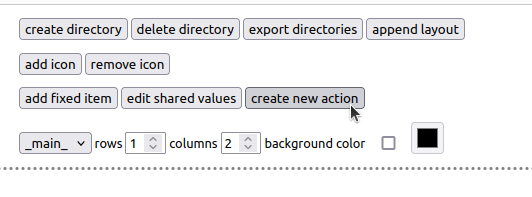
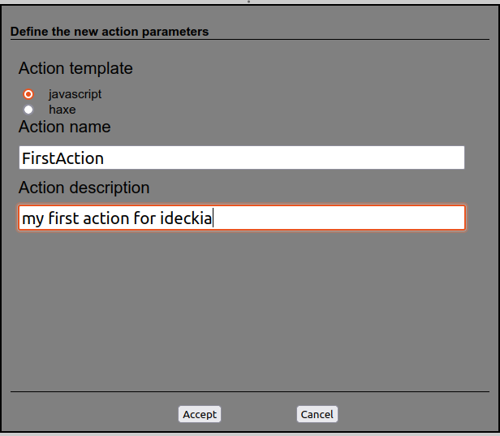
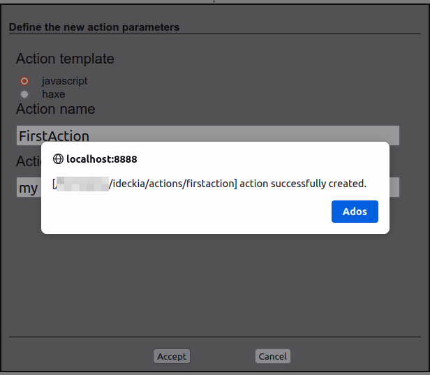
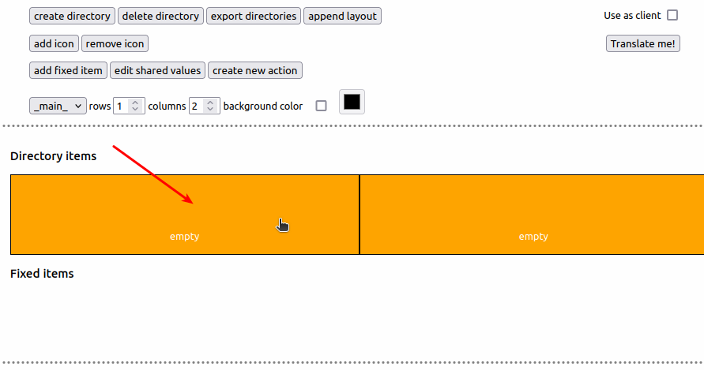
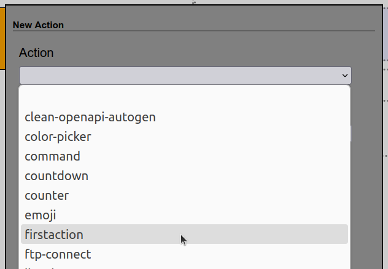
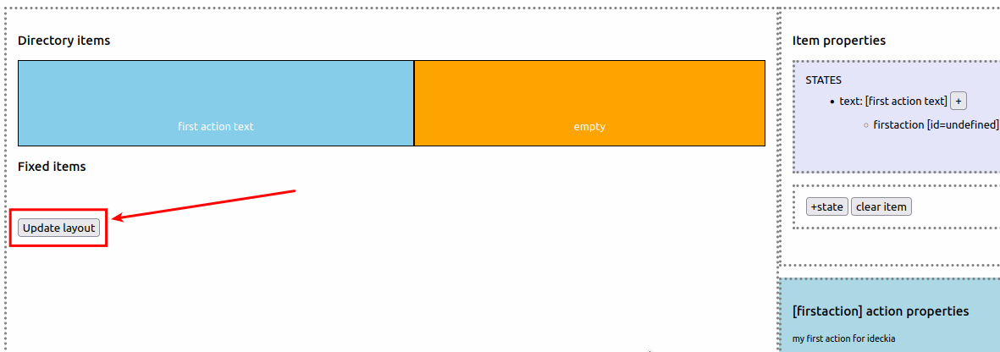
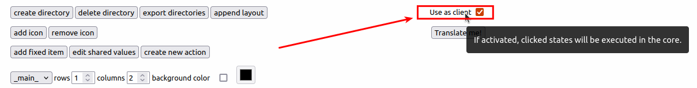

Post honetan ideckiarentzat gure lehenengo ekintza sortuko dugu, testua eguneratuko duen ekintza sinple bat. Pause hauek emanen ditugu:

* Ekintza berri bat sortu editoretik
* Ekintza berria editorean konfiguratu
* Espero bezala dabilela egiaztatu

ideckiaren ekintza bat sortzea zeinen erraza (eta azkarra) den ikusteko: ekintza bera sortu, editorean konfiguratu, emandako pausuek dokumentatu, pantaila-argazkiak egin, post hau idatzi, zuzenketa batzuk egin... eta **10 minuto** baino ez ditut behar izan.

### Aplikazioa prestatzen

Oraindik ez badugu ideckia deskargatu, hemendik [deskargatu](https://ideckia.github.io) eta direktorio batean deskonprimatu.

[Martxan jarri](https://github.com/ideckia/ideckia/blob/master/README.eu.md#nola-jarri-martxan)

Ekintzarik sortu baino lehen, garrantzitsua da oinarrizko kontzeptuak argi izatea:

* Layout: _item_ multzo bat.
* Item: _state_ bat edo gehiago izan ditzakeen elementua. Bezeroan klikagarria da.
* State: Itemaren egoeraren definizioa: text, textColor, bgColor, icon eta _action_ zerrenda bat.
* Action: Bezeroan botoia klikatzen denean ordenagailuan exekutatuko den ekintza (bat baino gehiago izan daiteke _state_ bakoitzean).

### Ekintza sortu

Sistemaren erretiluan ideckiaren ikonoa bilatu eta ireki->editorea. Edo zuzenean zure nabigatzailean [ireki](http://localhost:8888/editor).

Ekintza sortzeko unea! Egin klik `sortu ekintza berria` botoia.



Elkarrizketa-koadro batean galdetuko zaizkigu ekintzaren izena, deskribapen labur bat (hautazkoa) eta zein txantilioi erabili nahi dugun. Javascript aukeratuko dugu oraingoan. Haxe bertze tutorial baterako utziko dugu.



`Onartu` klikatzean, editoreak ekintza berria non sortu duen adieraziko digu.



Joan bide hortara eta ireki `index.js` nahi duzu editorearekin. Itxura hau du:

```javascript
const path = require('path');

/**
 * [Find here the action structure]{@link https://github.com/ideckia/ideckia_api/blob/main/README.md#action-structure}
 */
class FirstAction {

    /**
     * Method called to inject the properties and core access
     */
    setup(props, core) {
        this.props = props == null ? {} : props;
        this.core = core;
        this.localizedTexts = core.data.getLocalizations(path.join(__dirname, 'loc'));
    }

    /**
     * Method called when the action is loaded
     */
    init(initialState) {
        return new Promise((resolve, reject) => {
            resolve(initialState);
        });
    }

    /**
     * Method called when the item is clicked in the client
     */
    execute(currentState) {
        return new Promise((resolve, reject) => {
            reject(this.localizedTexts.tr(this.core.data.getCurrentLocale(), "not_implemented"));
        });
        // return new Promise((resolve, reject) => {
        //     resolve({state: currentState});
        // });
    }

    /**
     * Method called when the item is long pressed in the client
     */
    onLongPress(currentState) {
        return new Promise((resolve, reject) => {
            resolve({ state: currentState });
        });
    }

    /**
     * Method called from the editor to show if the action has any problems
     */
    getStatus() {
        return new Promise((resolve, reject) => {
            resolve({ code: 'ok' });
        });
    }

    /**
     * Method called when the state that belongs this action shows up
     */
    show(currentState) {
        return new Promise((resolve, reject) => {
            resolve(currentState);
        });
    }

    /**
     * Method called when the state that belongs this action goes out of sight
     */
    hide() {
    }

    /**
     * Method called from the editor to create an UI to configure the action
     */
    getActionDescriptor() {
        return new Promise((resolve, reject) => {
            resolve({
                name: "firstaction",
                description: this.localizedTexts.tr(this.core.data.getCurrentLocale(), "action_description"),
                // props : [{
                // 	name : "property_name",
                // 	type : "String",
                // 	isShared : false,
                // 	sharedName : "shared_property_name",
                //	defaultValue: "default value",
                // 	description : "property description",
                // 	values : ["possible", "values", "for the property"]
                // }]
            });
        });
    }
}

exports.IdeckiaAction = FirstAction;
```

### Azalpena

Xehetasun guztiak dituen azalpena aurki dezakezu [hemen](https://github.com/ideckia/ideckia_api/blob/main/README.md#action-structure). Baina oraingoz, ahalik eta sinpleena egin nahi dugunez, `execute` bakarrik begiratuko dugu. Erabiltzaileak ekintza hau duen item-ean klik egiten duenean deitzen da.

```javascript
execute(currentState) {
    currentState.text = 'Clicked at: ' + Date.now();
    return new Promise((resolve, reject) => {
        resolve({state: currentState});
    });
}
```
Kode honekin, item bat klikatzean:

* `execute` funtzioari deitzen zaio, uneko egoera pasatuaz (testua, atzeko kolorea, testuaren kolorea, ikonoa...) parametro moduan.
* Egoeraren testua aldatuko dugu uneko ordua idatziz.
* Bueltan itzuliko dugu eguneratutako egoera.

ideckia NodeJs aplikazio bat da, baita ekintzak ere. NodeJs-ko edozein pakete erabil daiteke ekintzetan. Baina ekintza __sinple__ bat sortzen ari gara, beraz ez gara hortan sartuko oraindik.

### Ekintza konfiguratu

Orain aplikazioa martxan jartzeko unea da (ez badago dagoeneko). Martxan dagoenean, ireki [editorea](http://localhost:8888/editor). Ekintza panelean gehituko dugu probatu ahal izateko. Kontzeptuak errepasatu nahi izanez gero, [hemen](https://github.com/ideckia/ideckia/wiki/Concepts) daude.

Leku huts bat aukeratu.



Item-a bera sortu.


'Aldatu Direktorioa' edo 'Egoera-Anitza' artean aukeratu beharko duzu. Bigarrena hartu.


(Hautazkoa) Egoera elementua aukeratu eta editatu: testua, testuaren kolorea, atzeko kolorea, ikonoa, testuaren tamaina...


Egoerari ekintza berria gehitzeko botoia klikatu


Gure ekintza aukeratu zerrendan



Klikatu `Eguneratu layout-a` botoia aldaketak gordetzeko.




### Probatzeko unea

ideckia-rentzat bezero desberdinak daude:

* Mugikorretarako bezero ofiziala, oraingoz android bakarrik. [github](https://github.com/ideckia/mobile_client/releases/latest).
* [Mahaigaineko bezero](https://github.com/josuigoa/ideckia_client/releases/latest) ez ofiziala, plataforma-anitza.

Baina tutorial honetan oinarri-oinarrizkoekin gabiltza. Eta editatzeko aparteko deskargarik egin ez dugun bezala, bezerorik ere ez dago deskargatu beharrik probetarako. Editorean bertan checkbox bat dago editorea bera bezero moduan erabili ahal izateko.



Item-a klikatu baino lehen, egoera sortzerakoan jarri diogun testua dago


Klik egin ondoren, testua eguneratuko da


### Aldatu kodea eta jostatu

Ederki, ulertu dugu zer gertatzen den. Ekintzarekin jostatzeko unea ailegatu zaizu. Zer gertatuko da......

* `currentState.bgColor` propietatea aldatzen baduzu? Eta `currentState.textSize` aldatuta?

Gogoratu item baten egoerak egitura hau duela:

```javascript
ItemState = {
    text
    textSize
    textColor
    textPosition // 'top', 'center' or 'bottom'
    icon
    bgColor
}
```

Ongi pasa!