In this post we will create our very first Ideckia action, a simple action to update an item with a text, we will follow these steps:

* Create a new action from the editor
* Configure the new action in the editor.
* Check it is working as expected

As a proof of what easy (and fast) is to create an action for Ideckia: I've created the action itself, configured it in the editor, documented each step, took screenshots, write a basic post, some bugfixes in the core app... and it took me **only 10 minutes**.

### Preparing the application

If we haven't Ideckia in our machine, we must [download](https://ideckia.github.io) and uncompress it in a directory.

[Here is how can you get it working](https://github.com/ideckia/ideckia?tab=readme-ov-file#how-to-get-it-working)

Before create any action, I think it's important to keep in mind some core concepts of ideckia:

* Layout: Bunch of _items_
* Item: An element that has one or more _states_ and is clickable.
* State: Definition of the item status: text, textColor, bgColor, icon and some _actions_ which will be executed when the item is pressed.
* Action: The actual software that will be executed in the computer.

### Create the action

Find the ideckia icon in the system tray and Open->Editor. Or you can go directly to your browser and go to [this direction](http://localhost:8888/editor).

Time to create the action! Click in the `create new action` button.

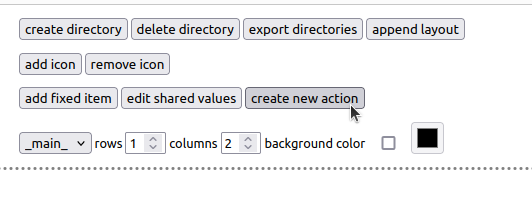

A dialog will open to ask you for the name of the action, a short description (optional) and what template do you want to use. Here we are creating a new javascript action. We will create a haxe one in another tutorial.

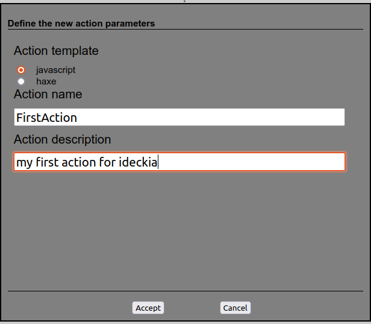

Once you click `Accept`, the editor will tell you in which path does it created the action.

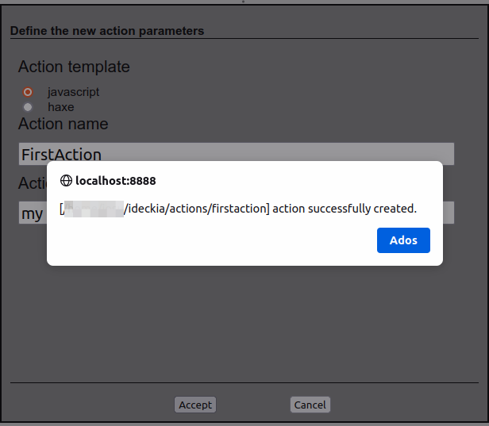

Go to that path and open the `index.js` with you editor of choice. This is how it looks like:

```javascript
const path = require('path');

/**
 * [Find here the action structure]{@link https://github.com/ideckia/ideckia_api/blob/main/README.md#action-structure}
 */
class FirstAction {

    /**
     * Method called to inject the properties and core access
     */
    setup(props, core) {
        this.props = props == null ? {} : props;
        this.core = core;
        this.localizedTexts = core.data.getLocalizations(path.join(__dirname, 'loc'));
    }

    /**
     * Method called when the action is loaded
     */
    init(initialState) {
        return new Promise((resolve, reject) => {
            resolve(initialState);
        });
    }

    /**
     * Method called when the item is clicked in the client
     */
    execute(currentState) {
        return new Promise((resolve, reject) => {
            reject(this.localizedTexts.tr(this.core.data.getCurrentLocale(), "not_implemented"));
        });
        // return new Promise((resolve, reject) => {
        //     resolve({state: currentState});
        // });
    }

    /**
     * Method called when the item is long pressed in the client
     */
    onLongPress(currentState) {
        return new Promise((resolve, reject) => {
            resolve({ state: currentState });
        });
    }

    /**
     * Method called from the editor to show if the action has any problems
     */
    getStatus() {
        return new Promise((resolve, reject) => {
            resolve({ code: 'ok' });
        });
    }

    /**
     * Method called when the state that belongs this action shows up
     */
    show(currentState) {
        return new Promise((resolve, reject) => {
            resolve(currentState);
        });
    }

    /**
     * Method called when the state that belongs this action goes out of sight
     */
    hide() {
    }

    /**
     * Method called from the editor to create an UI to configure the action
     */
    getActionDescriptor() {
        return new Promise((resolve, reject) => {
            resolve({
                name: "firstaction",
                description: this.localizedTexts.tr(this.core.data.getCurrentLocale(), "action_description"),
                // props : [{
                // 	name : "property_name",
                // 	type : "String",
                // 	isShared : false,
                // 	sharedName : "shared_property_name",
                //	defaultValue: "default value",
                // 	description : "property description",
                // 	values : ["possible", "values", "for the property"]
                // }]
            });
        });
    }
}

exports.IdeckiaAction = FirstAction;
```

### Explanation

You can see a detailed explanation of every method [here](https://github.com/ideckia/ideckia_api/blob/main/README.md#action-structure). But for now, we will keep as simple as possible and will focus only on the `execute` method. This method is called when the user clicks in the item which belongs this action.

```javascript
execute(currentState) {
    currentState.text = 'Clicked at: ' + Date.now();
    return new Promise((resolve, reject) => {
        resolve({state: currentState});
    });
}
```

With this code, when the item is clicked:

* `execute` method is called with the current state (text, background color, text color, icon...) as parameter.
* We change the state text showing the current timestamp.
* We send back the updated state with a promise.

Note that ideckia is an NodeJs application and so are the actions. You can use any existing NodeJs package in your action. But here we are creating a __simple__ action, so we are not adding nothing fancy to our first action.

### Configure the action

Now we must start the application (if it isn't already). When it is running, go to the [editor](http://localhost:8888/editor). We will add the action to the panel to test it. If you want to recall the core concepts of ideckia, they are [here](https://github.com/ideckia/ideckia/wiki/Concepts)

Select an empty item spot.

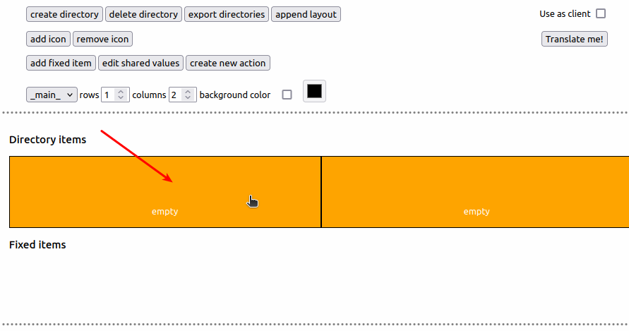

Create an actual item.

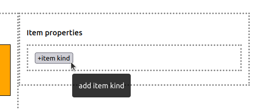

It will ask you to select between 'Change directory' or 'Multi-State'. We will select the second one.

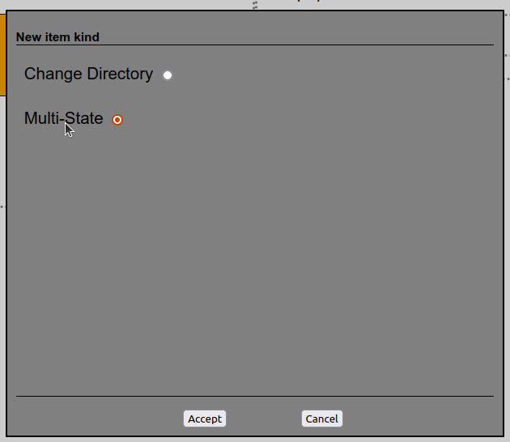

(Optional) Select the state element and edit it: text, text color, background color, icon, text size...

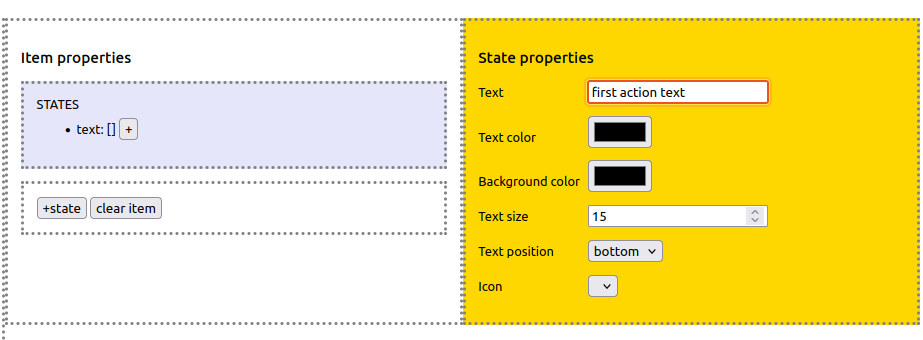

Click the button to add a new action to the state

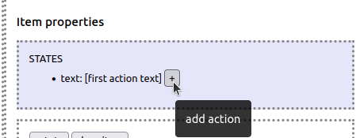

Select our action from the actions list

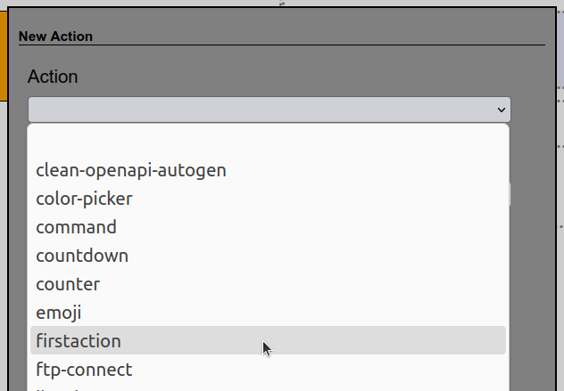

Click the `Update layout` button to save the changes.

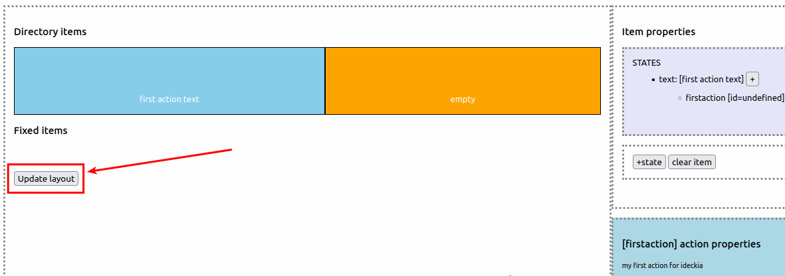


### Time to test

There are some clients for ideckia:

* An official mobile client, only android for now. [github](https://github.com/ideckia/mobile_client/releases/latest).
* An unofficial [desktop client](https://github.com/josuigoa/ideckia_client/releases/latest), multi-platform.

But here we are working with the very basics of ideckia. And like the editor, you don't have to download anything extra than the app itself. There is a checkbox in the editor to use it as client.

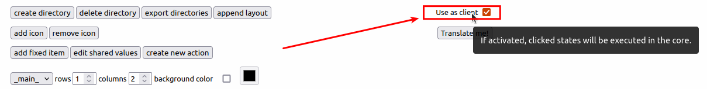

Before you click the item, there is the text we put when created the state

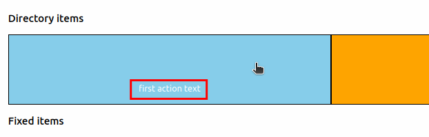

Once clicked the item, it updates the text

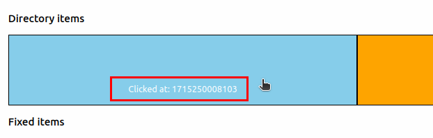

### Change the code and play with it

Ok, you've seen what is going on. Now it is time to tinker with the new action. What will happen if you...

* Change the `currentState.bgColor` property? And the `currentState.textSize` property?

Remember that the state of the item has this structure:

```javascript
ItemState = {
    text
    textSize
    textColor
    textPosition // 'top', 'center' or 'bottom'
    icon
    bgColor
}
```

Have fun!